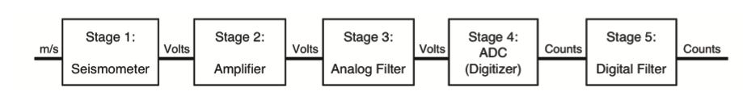

.. Put any comments here
   Be sure to indent at this level to keep it in comment.

A seismic recording system can be considered a sequence of stages.

Introduction
^^^^^^^^^^^^^^^^^^^^^

The theory of instrument response is contained in the theory of
linear, time invariant systems, used to describe differential equations
where the coefficients are constant and hence do not change with time.
Each stage imparts a signature on its input signal.
In the time domain, we say the output of the stage is equal to the
stage input, convolved with the stage impulse response, given by
:math:`h(t)` for a continuous (analog) stage and :math:`h[n]` for a
discrete stage.

For such systems, the overall frequency response of the system is given by
the product of the individual stage responses.
e.g., for k stages numbered 1 to N,

.. math::

   G(f)=\Pi_{k=1}^{N} G_{k}(f)

Linear Time Invariant (LTI) Systems
^^^^^^^^^^^^^^^^^^^^^^^^^^^^^^^^^^^^^^^^^

Linear and time invariant systems can be fully described
in several ways, all equally valid:

#. By the linear differential equation that describes the system
#. By the system impulse response
#. By the system step response
#. By the Laplace transfer function
#. By the complex (Fourier) frequency response

Any one of these is a complete description of the system; which one
we choose to work with usually depends on our purpose.
For instance, for edge detection, a common task of image processing,
we care most about the shape of the step response,
whereas
in digital filtering, the complex frequency response is often
most important.

The Laplace transform of a continuous (analog) stage impulse response, :math:`h(t)`,
is known as the (system) transfer function, :math:`H(s)`.
For analog sensors (e.g., seismic sensors) that measure in continuous time, we 
generally describe the effect of the sensor stage using the poles and zeros factorization 
of :math:`H(s)`.

For purely digital stages (e.g., anti-alias FIR filters), the
transfer function :math:`H(z)` is given by the z-transform of the discrete impulse response, :math:`h[n]`,
and we are generally interested in the poles and zeros of :math:`H(z)` or
alternatively, the corresponding polynomial coefficients.

To obtain the frequency response of a stage, for analog stages,
we evaluate the transfer function :math:`H(s)` along the imaginary axis, 
:math:`s=j\omega \rightarrow H(j\omega)`, while for 
digital stages, we evaluate the digital transfer function :math:`H(z)`
on the unit circle, :math:`|z|=1` where :math:`H(z)\rightarrow H(e^{j\omega})`.

Fortunately, if we know any one description of an LTI system, we can derive the others.
For instance, the system step response is found by integrating
the impulse response with respect to time.
Similarly, the Fourier response can be found by evaluating
the Laplace transfer function along the imaginary axis as described
below.

The Fourier Transform
^^^^^^^^^^^^^^^^^^^^^^^^^^

.. include:: transform-fourier.rst

The Laplace Transform
^^^^^^^^^^^^^^^^^^^^^^^^^^

.. include:: transform-laplace.rst

The z-Transform
^^^^^^^^^^^^^^^^^^^^^^^^^^

.. include:: transform-z.rst

